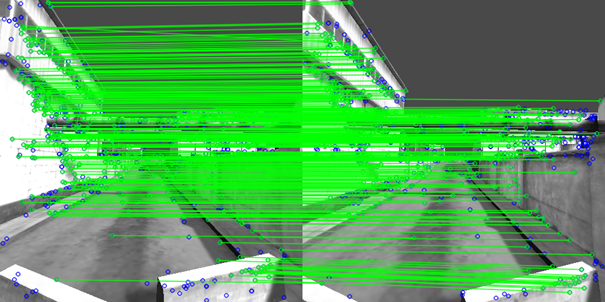
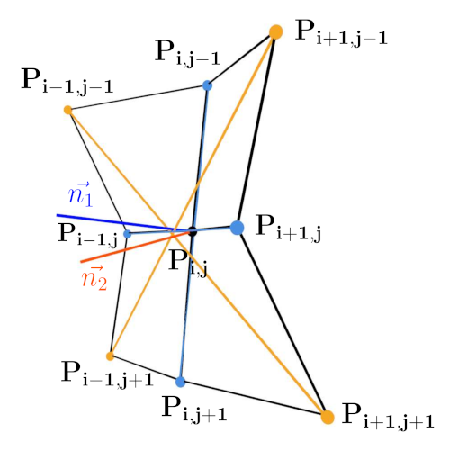
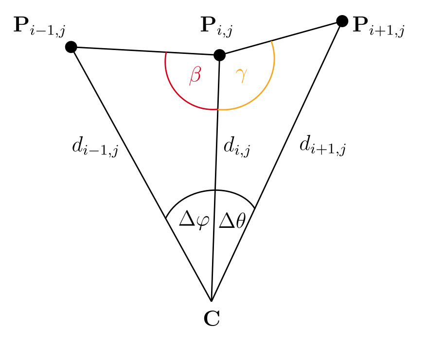

## Comparison of feature-based pose estimation and localization methods in dark environments

Lecturer: Jonas Fleicher 
Date: 06-04-2024

#### What is it about?

- Area in computer vision
- Deals with the prediction and reconstruction of the pose (describes the position and orientation of an object in space) of an object/ subject in $ \mathbb{R}^3 $.

#### Importance
- can be used:
  - to determine the **pose** of **object(s)** in space
  - to determine your **own position/ orientation** in space
  - for **SLAM** in conjunction with autonomous vehicles/ robots
  - for orientation and navigation in areas where navigation with **GNSS** alone is not sufficient (-> accuracy, availability)
- Possibility to fuse sensors and methodologies
=> **Environment Detection and Awareness**

#### Approaches

#### Discussion
##### Requirements for SLAM
- Accuracy of pose estimation
- Processing speed/ Performance
- Reliability/ Robustness
##### Ideal Scenario
Sensor and Model **Fusion**
- Redundancy
- Complementarity
##### 3D Depth Images
- Radar
- ToF
- LiDAR
- Structured Light Sensor
#### Comparison
##### Criteria/ Metrics
- Performance
- Robustness/ Accuracy
- Simplicity of Implementation
##### Potential problems
- Procurement of different sensors (cost, time)
- Use of the approaches to be investigated may require adaptation/ self-implementation 
- Availability of the necessary software/ hardware not necessarily given 
- Testing only possible with given hardware & softwareware
#### Procedure
1. Selection/ creation of a test scenario

     - only synthetic
     - e.g. path in a Blender scene
2. Selection of considered selected models

     - Restriction to approaches that can recognize general features in the data 
     - Avoidance of own implementations (time, scope)
3. Application of selected models to the data from the test scenario
4. Measurement of processing times for the scenario
5. Measuring the deviation of the estimation from the absolute position
6. Extension of the comparison by pre-processing the depth data

     - Flexion images

     - Bearing-Angel images

#### Appendix
##### Flexion Images
- Input: depth image
  - Depth image has to be in specific format (-> camera intrinsic)
- Calculating Flexion:
  - Angle between normals $\vec{n_1}$ and $\vec{n_2}$ of (horizontal and vertical) neighbors and diagonal neighbors
  - Consideration: nearest or next-neighbor

##### (Multi-Directional) Bearing-Angle Images
- Input: depth image 
  - Depth image has to be in specific format (-> camera intrinsic)
- Calculation Bearing-Angle:
  - Angle between two neighboring pixels ($\beta$ and $\gamma$)
  - 0 $\le$ **angle** $\le$ $\pi$
  - Angle represents color in resulting image
- Problem:
  - Rotation invariance not given for BA images
  - Rotation invariance given for MDBA images
  - MDBA images contain only outlines of objects

