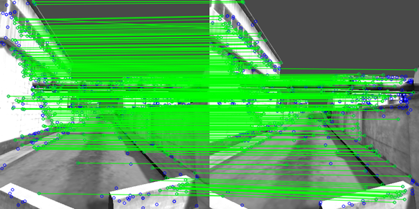
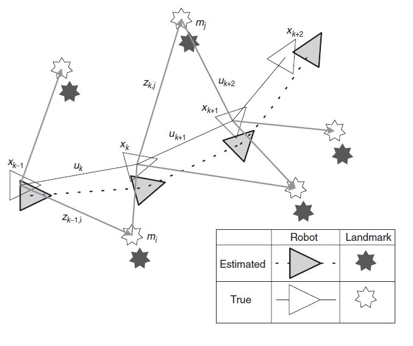
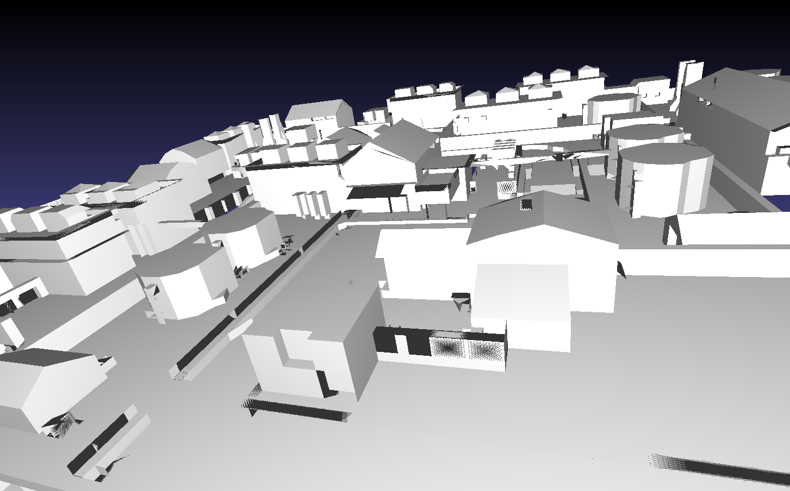
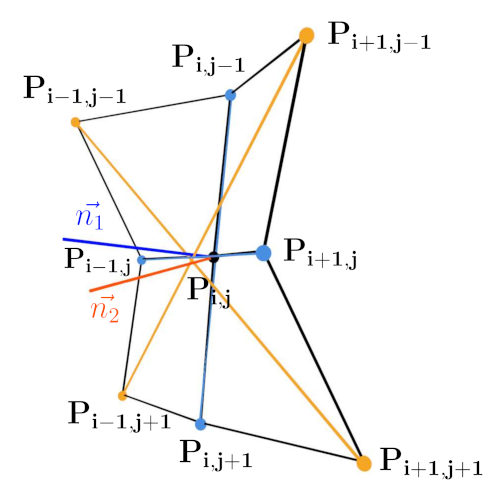
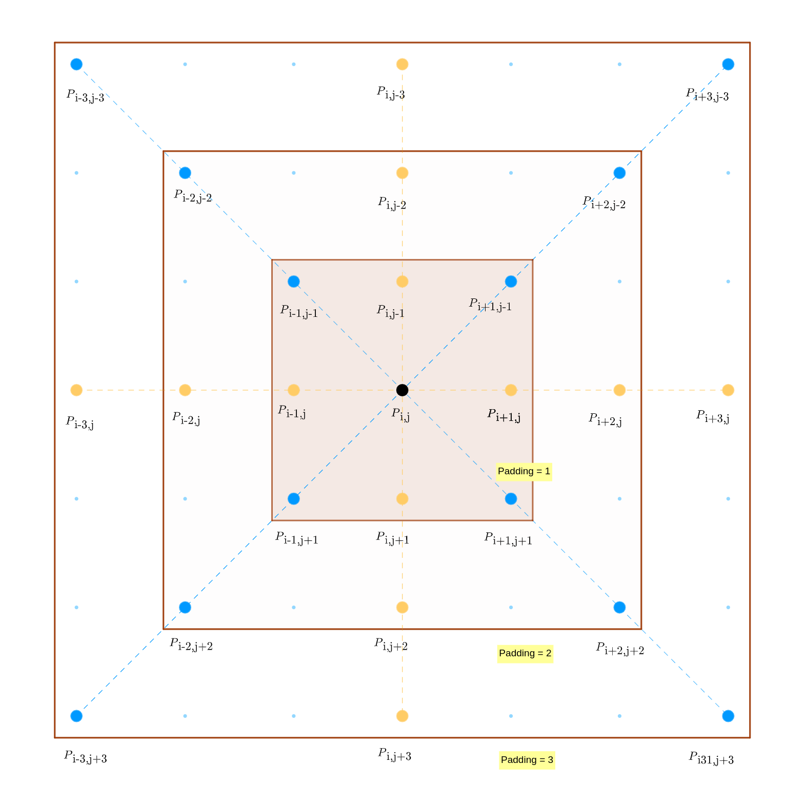
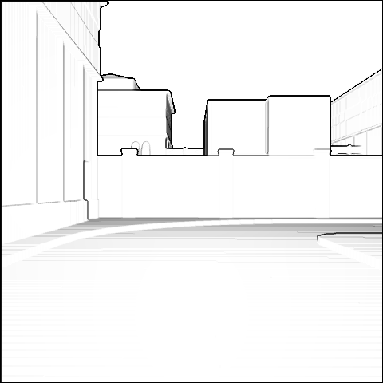
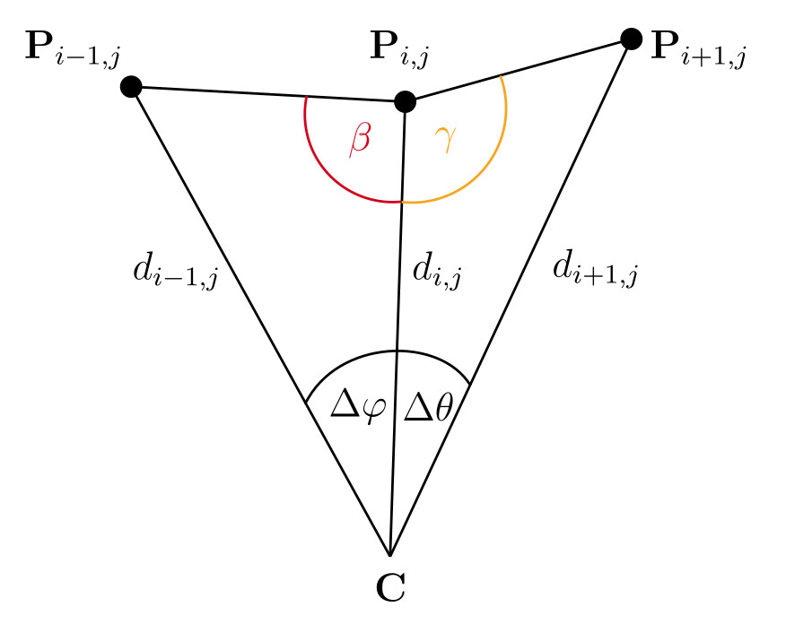
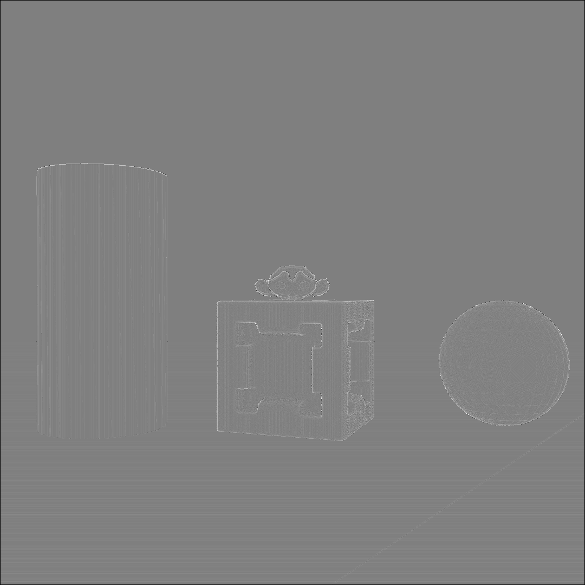

<!--
author:   Jonas Fleischer

email:    jonas.fleischer@student.tu-freiberg.de

version:  1.0.0

language: en

narrator: US English Female

comment: presentation for Seminar Robotik SoSe 2024, "Feature based pose estimation in dark environments" 

link:     https://cdn.jsdelivr.net/chartist.js/latest/chartist.min.css

script:   https://cdn.jsdelivr.net/chartist.js/latest/chartist.min.js


script:   https://cdn.jsdelivr.net/npm/mermaid@10.5.0/dist/mermaid.min.js

logo: assets/logo.png
icon: assets/logo.png


@onload
mermaid.initialize({ startOnLoad: false });
@end

@mermaid: @mermaid_(@uid,```@0```)

@mermaid_
<script run-once="true" modify="false" style="display:block; background: white">
async function draw () {
    const graphDefinition = `@1`;
    const { svg } = await mermaid.render('graphDiv_@0', graphDefinition);
    send.lia("HTML: "+svg);
    send.lia("LIA: stop")
};

draw()
"LIA: wait"
</script>
@end

@mermaid_eval: @mermaid_eval_(@uid)

@mermaid_eval_
<script>
async function draw () {
    const graphDefinition = `@input`;
    const { svg } = await mermaid.render('graphDiv_@0', graphDefinition);
    console.html(svg);
    send.lia("LIA: stop")
};

draw()
"LIA: wait"
</script>
@end

-->

# Comparison of feature-based pose estimation and localization methods in dark environments

Lecturer: Jonas Fleicher 

Date: 06-04-2024

[](https://liascript.github.io/course/?https://github.com/halbersacknuesse/seminar_sose_2024/blob/master/presentation_files/presentation.md)

<section>
!?[SLAM_loop](assets/videoplayback.mp4 "Example for SLAM[^vid_00]")<!--
autoplay="true"
muted="true"
loop="true"
-->
[^vid_00]: cygot lab. "2D / 3D Dual SLAM Robot using ROS and LiDAR with Raspberry Pi". YouTube [online] [URL](https://www.youtube.com/watch?v=34n1tF5OtQU) (05-30-2024)
</section>


## Structure

1. [What is it about?](#3)
2. [Importance](#4)
3. [Approaches](#5)
4. [Discussion](#6)
5. [Comparison](#7)

    - Criteria/ Metrics
    - Approaches
    - Conceivable problems for the Comparison

6. [Procedure for the paper](#8)

### What is it about?
- Area in computer vision
- Deals with the prediction and reconstruction of the pose[^*] of an object/ subject in $ \mathbb{R}^3 $.

 

[^*]: describes the position and orientation of an object in space.
[^1]: Fleischer et al. "Schriftliche Ausarbeitung zum Seminar virtuelle Realität". In 2023 Technische Universität Bergakademie Freiberg.
[^2]: H. Durrant-Whyte and T. Bailey. "Simultaneous Localization and Mapping(SLAM): Part I". In IEEE Robotics & Automation Magazine 13.2 (2006), S. 99 110. doi: 10. 1109/MRA.2006.1638022.

### Importance
- can be used:

  - to determine the **pose** of **object(s)** in space[^3],[^4]
  - to determine your **own position/ orientation** in space
  - for haptic interaction with objects[^5]
  - for **SLAM[^*]** in conjunction with autonomous vehicles/ robots[^1]
  - for orientation and navigation in areas where navigation with **GNSS[^**]** alone is not sufficient (-> accuracy, availability)[^6]

- Possibility to fuse sensors and methodologies

> => **Environment Detection and Awarness**

[^*]: simultaneous localization and mapping
[^**]: global navigation satellite system
[^1]: Fleischer et al. "Schriftliche Ausarbeitung zum Seminar virtuelle Realität". In 2023 Technische Universität Bergakademie Freiberg.
[^3]: Marullo et al. "6D object position estimation from 2D images: a literature review". In Multimedia Tools and Applications , Vol. 82, No. 16 p. 24605-24643.
[^4]: Liu et al. "Hand Pose Estimation from RGB Images Based on Deep Learning: A Survey". In 2021 IEEE 7th International Conference on Virtual Reality (ICVR).
[^5]: Engelmeyer. "Autonomes Greifen eines Objekts mit einem Roboterarm". In 2012 Freie Universität Berlin, Institut für Informatik.
[^6]: Lösch et al. "Design of an Autonomous Robot for Mapping, Navigation, and Manipulation in Underground Mines". In 2018 IEEE/RSJ International Conference on Intelligent Robots and Systems (IROS) , p. 1407-1412.


### Approaches
<div style="border: 2px solid black;">
  <h3><center>Process Chain</center></h3>
  <script style="display: block; background: white; width: 100%;" run-once="true" modify="false">
  
  const graphDefinition = `graph LR
    A[1. Data Capture] --> B[2. Pre-Processing]
    B --> C[3. Model Selection and Application]
    C --> D[4. Feature Extraction]
    D --> E[5. Pose Estimation]
  	E --> F[6. Action]
  	F --> A`;
  
  async function draw () {
      const { svg } = await mermaid.render('graphDiv', graphDefinition);
      send.lia("HTML: "+svg);
      send.lia("LIA: stop")
  };
  
  draw()
  "LIA: wait"
  </script>

</div>


{{1}} #### Data Capture

> - via Optical Sensors:
>
>  - RGB Camera(s)
>
> - via Depth Sensors:
>
>  - LiDAR[^*]
>  - RADAR[^**]
>  - Structured Light Sensor
>  - ToF[^***]


[^*]: Light detection and ranging or Light imaging, detection and ranging

[^**]: Radio Detection and Ranging

[^***]: Time of Flight


{{2}} #### Pre-Processing

> - Image/ Data filtering
>
>  - Gauss
>  - Kalman
>  - ...
> - Normalization and Formatting[^->]
> - [Flexion algorithm[^1]](#10)
> - [Bearing-Angle algorithm [^12]](#10)

[^->]: converting color depths, image formats

{{3}} #### Model Selection and Application

> - [SIFT (Scale-Invariant Feature Transform)](#10)
> - [SURF (Speeded Up Robust Features)](#10)
> - [AKAZE (Accelerated KAZE[^****])](#10)
> - [FAST (Feature from Accelerated Segment Test)](#10)

[^****]: japanese "wind"


{{4}} #### Feature Extraction

> - Edges 
> - Points
> - Textures
> - Colors


{{5}} #### Pose Estimation

> - Use of the extracted features in conjunction with feature mapping algorithm.
> - e.g. FLANN-Algorithm


{{6}} #### Action

> - Interaction with recognized object
> - Global orientation/ localization
>
> => Navigation/ movement/ interaction/ drive command/ mapping

[^12]: Toth. "Post-Processing of Depth Images and Laser Scan Data for Feature-based Pose Estimation". In 2020 Technische Universität Bergakademie Freiberg. github.com [online] [URL](https://github.com/JonasToth/depth-conversions.git) (05-30-2024).

[^1]: Fleischer et al. "Schriftliche Ausarbeitung zum Seminar virtuelle Realität". In 2023 Technische Universität Bergakademie Freiberg. github.com [online] [URL](https://github.com/TUBAF-IFI-VR/Projektseminar22-23) (05-30-2024).


### Discussion

{{1}} #### Requirements for SLAM

- Accuracy of pose estimation
- Processing speed/ Performance
- Reliability/ Robustness

> - Essential for autonomous vehicles
>
>  - Context: relying exclusively on information from ~ (-> GNSS too inaccurate)

> - Accuracy must be high enough to rule out incorrect navigation 
>
>  - e.g. running into an object

> - Processing speed must be high enough to handle sudden/temporary changes in the environmental situation (-> real-time capability) 
>
>  - Hardware and implementation must be set up accordingly

> - Reliability/ Robustness must be so high that SLAM can be used even under unfavorable conditions.
>
>  e.g:
>
>  - Fog, snow, rain
>  - Darkness
>  - Failure/ non-existence of other positioning options
>  - Sudden/ temporary changes in the environmental situation (obstacles, vulnerable objects)
>  - Absence of features (e.g. textures, objects, edges, ...)


{{2}} #### Ideal Scenario
Sensor and Model **Fusion**

- Redundancy
- Complementarity

> - Increases the **complexity** of the system, as interdependencies can arise (depending on the model/ approach)
> - Possibly increases resource requirements

{{3}} #### AI Approaches

- not in scope

{{4}} #### 2D RGB

- No depth information in images 

> -> would have to be modeled

- Features are limited to edges, textures and colors 

> -> Differentiation through color changes in the image
  
- Possible further processing using machine learning (-> not in scope)

  - Robustness is not necessarily given due to changes in lighting conditions (-> outdoor)

> - Ideal scenario:
>
>  - Constant lighting conditions
>  - Adequate camera/ resolution
>  - High contrast between objects/ features to be recognized
>
>> => SLAM should be possible here


!?[SLAM_loop](assets/KITTI.mp4 "KITTY Dataset 03, edited as videoclip[^vid_01]")<!--
autoplay="true"
muted="true"
loop="true"
-->

[^vid_01]: Andreas Geiger et al. "Vision meets Robotics: The KITTI Dataset". cvlibs.net [online] [URL](https://s3.eu-central-1.amazonaws.com/avg-kitti/raw_data/2011_09_26_drive_0001/2011_09_26_drive_0001_extract.zip) (05-30-2024), edited by Fleischer.


{{5}} #### 3D Depth Images

|Sensor|Robustness|Output|Complexity|Accuracy[^*]|
|-----|-----|-----|-----|-----|
|Radar[^7]|high, insensitive to light conditions, weather conditions|Distance + Velocity|medium (requires processing)| very high|
|ToF|medium, can be used in very poor lighting conditions, can provide accurate data even in absolute darkness, possible impairment due to weather conditions|Depth information/ Depth map|medium (requires processing)|high|
|LiDAR[^8]|medium - high, can be used in very poor lighting conditions, can provide accurate data even in absolute darkness, possible impairment due to weather conditions|3D-Point cloud|high (requires complex algorithms to process point clouds)|very high (can create highly accurate maps of the environment)|
|Stereo camera[^9] (only with external lighting)|low - medium, depending on lighting conditions, texture of the scene, can be affected by poor lighting, weather conditions|Depth information/ Depth map|high requires stereo matching, triangulation|medium - high depending on surrounding, camera specs|
|Structured Light Sensor[^10]|low depending on lighting conditions, texture of the scene, can be affected by poor lighting, weather conditions + surface material|Depth information/ Depth map|high (requires complex algorithms to decode light structures)|high can create very accurate depth maps|

[^*]: Accuracy depends on the sensor
[^7]: Infineon. "Why radar sensors are powerful enablers for intelligent IoT applications". infineon.com [online] [URL](https://www.infineon.com/dgdl/Infineon-Infineon-Radar-IoT-Sensors-Article-v01_00-EN.pdf?fileId=8ac78c8c821f389001823a17b2ad1c1b) (05-31-2024).
[^8]: Sick AG. LiDAR-Sensoren. sick.com [online] [URL](https://www.sick.com/de/de/catalog/produkte/lidar-und-radarsensoren/lidar-sensoren/c/g575802?view=variants) (05-30-2024).
[^9]: Ma et al. "Robust Stereo Visual-Inertial Odometry Using Nonlinear Optimization". In 2019 Sensors , Vol. 19, No. 17.
[^10]: Gu et al. "High-Capacity Spatial Structured Light for Robust and Accurate Reconstruction". In 2023 Sensors , Vol. 23, No. 10.

- Further processing should be taken in consideration

  - Possibly valid approach: Calculation of Flexion images


### Comparison
<section>
#### Criteria/ Metrics


> {{1}} Performance
>
> - Synthetic scenario
> - Use of identical Hardware


> {{2}} Robustness/ Accuracy
>
> - Creation of restrictive condition (fog, darkness, ...)
> - Testing the robustness against this influence
> - If necessary, fall back on other sensors/ switch the sensor system
>   - Analysis of the resulting time/calculation effort
> - Deviation between estimation and absolute pose (-> must be known in the scenario)

> {{3}} Simplicity of Implementation
> 
> - Costs of the sensor technology
> - Complexity of the setup
> - Structure of the sensor fusion
> - Can the approaches be implemented simply and effectively in a test environment?
> - Are there any special features (specific hardware/ software) to consider?


#### Approaches

> - Priority: Approaches with sensor technology that does **not** rely on optical sensors
> - Should not be linked to specific hardware (e.g. NVIDIA)
>
>   - Use of generic sensors
>
> - Test scenario: synthetic
>
>   - High complexity of implementing different approaches in reality
>   - Better comparability
>   - Application of **different approaches/ algorithms** to synthetic scenario


#### Potential problems

> - Procurement of different sensors (cost, time)
> - Use of the approaches to be investigated may require adaptation/ self-implementation 
> - Availability of the necessary software/ hardware not necessarily given 
> - Testing only possible with given hardware -> results may be different on other hardware
> - Testing only possible with given software -> the software may not run optimally on the test hardware; the software itself may not be optimized
> - Use of real scenarios could reduce comparability (consistency of test runs not necessarily given)

</section>

### Procedure

> {{1}} Selection/ creation of a test scenario
> 
> - only synthetic
> - e.g. path in a Blender scene
>
>  - blainder-plugin[^11] is able to simulate LiDAR, Sonar and ToF sensors
>  - Using blainder-plugin to acquire simulated depth data (internal handled as **Point Cloud**)
>
> - As the focus is on depth data: Textures can be neglected.
> - Possible test scenario is already given from a previous work[^1].




> {{2}} Selection of considered [selected models](#5)
> 
> - Restriction to approaches that can recognize general features in the data
> - Exclusion of approaches that are limited to the recognition of certain objects only 
> - Avoidance of own implementations (time, scope)


> {{3}} Application of [selected models](#5) to the data from the test scenario
> 
> - Restriction to the use of depth data 
> - No use of optical sensors


> {{4}} Measurement of processing times for the scenario
> 
> - Real-time calculation possible?


> {{5}} Measuring the deviation of the estimation from the absolute position
> 
> - Consideration of several measuring points within the path -> thus determination of the accumulation of errors


> {{6}} Extension of the comparison by pre-processing the depth data
> 
> - Flexion images
> - Bearing-Angel images

[^1]: Fleischer et al. "Schriftliche Ausarbeitung zum Seminar virtuelle Realität". In 2023 Technische Universität Bergakademie Freiberg.
[^11]: blainder-range-scanner. github.com [online] [URL](https://github.com/ln-12/blainder-range-scanner) (05-31-2024).

## Questions & Suggestions

> Questions?

> Suggestions?
>
> - Procedure
>
> - Content


## Appendix

{{1}} #### Flexion Images

- Input: depth image

  - Depth image has to be in specific format (-> camera intrinsic)

- Calculating Flexion:

  - Angle between normals $\vec{n_1}$ and $\vec{n_2}$ of (horizontal and vertical) neighbors and diagonal neighbors

  - Consideration: nearest or next-neigbor

  


{{2}} #### (Multi-Directional) Bearing-Angle Images

- Input: depth image 

  - Depth image has to be in specific format (-> camera intrinsic)

- Calculation Bearing-Angle:

  - Angle between two neighboring pixels ($\beta$ and $\gamma$)

  - 0 $\le$ **angle** $\le$ $\pi$

  - Angle represents color in resulting image

- Problem:

  - Rotation invariance not given for BA images

  - Rotation invariance given for MDBA images

  - MDBA images contain only outlines of objects

  implementation of the Bearing-Angle formula.[^12]}") 

[^12]: Toth. "Post-Processing of Depth Images and Laser Scan Data for Feature-based Pose Estimation". In 2020 Technische Universität Bergakademie Freiberg. github.com [online] [URL](https://github.com/JonasToth/depth-conversions.git) (05-30-2024).

[^1]: Fleischer et al. "Schriftliche Ausarbeitung zum Seminar virtuelle Realität". In 2023 Technische Universität Bergakademie Freiberg. github.com [online] [URL](https://github.com/TUBAF-IFI-VR/Projektseminar22-23) (05-30-2024).


{{3}} #### SIFT (Scale-Invariant Feature Transform)[^12]


- Goal: 

  - Detect keypoints invariant to scale and rotation, robust against noise, illumination changes, and affine transformations.

- Process:

  - Input image processed in a hierarchical pyramid of down-scaled versions (octaves).
  - Gaussian filter applied consecutively with increased standard deviation on each octave.
  - Difference of Gaussian (DoG) computed, forming an approximation of the Laplacian of the image.

- Keypoint Candidates:

  - Local extrema in DoGs.
  - Filtered by a contrast threshold, position determined using local spline interpolation, scale assigned based on octave and blurring factor.

  <!-- style="display:none" -->
  <div style="display:block" id="fooBar">
  - Edge-like responses filtered with an estimate of the ratio between the principal curvatures.
  </div>

- Orientation Assignment:

  - Brightness gradients of the local neighborhood stored in an orientation histogram.
  - Each peak reflects a dominant direction of gradients, corresponding angle used as the orientation of the keypoint.

- Descriptor Computation:

  - Image gradients direction and magnitude computed for each pixel in a local environment.
  - Weighted by a Gaussian, binned into orientation histograms.
  - A 16×16 grid around the keypoint, stored to 4×4 histograms with 8 bins for the orientations, results in a vector of 128 elements in the descriptor.
  - Histograms normalized to increase robustness against illumination changes.


{{4}} #### SURF (Speeded-Up Robust Features)[^12]

- Achieves similar detector and descriptor performance as SIFT but at a lower computational cost.
- Integral Images: 

  - Each pixel’s value is the sum of all pixels in the rectangle formed by the origin and the pixel itself, reducing computational complexity.

- Scale Space and Extrema Detection: 

  - Derived from the same principles as SIFT but simplified. Gaussian convolution approximated with a box filter related to the Hessian matrix.

- Filter Scaling: 

  - Instead of building a pyramid of images at different scales, the filter itself is scaled up successively.

- Maxima Suppression: 

  - Maxima undergo non-maximum suppression at different scales. The maximum of the Hessian determinant for the detected pixel is interpolated in image scale and space.

- Orientation Assignment: 

  - Can be skipped for scenarios that do not involve camera rotation. Derived from the Haar wavelets response in x- and y-direction in the local neighborhood.

- Descriptor Construction: 

  - Constructed from a 4×4 grid structure of sample points around the detected keypoint. The Haar wavelets response in x- and y-direction are used to derive the elements of the descriptor.


{{5}} #### AKAZE (Accelerated KAZE)[^12]

- KAZE and AKAZE: 

  - Approaches similar to SIFT. KAZE applies non-linear diffusion filtering, preserving edges over higher scales.

- Scale Space Analysis: 

  - Diffusion of brightness is the starting point. Non-linear diffusion filtering applied with a special computational scheme, feasible to solve the diffusion in real time.

- Edge Preservation:

  - Unlike Gaussian blurring which blurs the whole image, non-linear diffusion preserves edges over higher scales.

- Keypoint Position: 

  - After non-maximum suppression, the determinant of the Hessian is computed. Interpolation of the maximum on different scales yields the position of the keypoint.

- Keypoint Orientation: 

  - Similar to SIFT, the dominant direction of the derivatives in the local neighborhood of the keypoint.

- Descriptor (M-LDB): 

  - Based on LDB (Local Difference Binary), works similar to BRIEF. Instead of comparing intensities of sampled pixel, it compares the average intensities of sampled areas around the keypoint. The orientation of the keypoint is taken into account when sampling the areas.


{{6}} #### FAST (Features from Accelerated Segment Test)[^12]

- Part of ORB (Oriented FAST and Rotated BRIEF), designed to be computationally cheaper than SIFT and SURF.

- Pixel Evaluation: 

  - Each pixel is evaluated by testing the brightness of 16 pixels on a circle around it. If there are enough consecutive pixels brighter or darker than the center with a certain threshold, the pixel is accepted as a corner.

- Decision Tree: 

  - The approach results in a decision tree. The optimal traversal of this tree is learned by observing real-world execution of the algorithm on predefined traversal.

- Keypoint Detection: 

  - ORB detects keypoints with FAST, filters edge results with the Harris corner detector, and assigns scale using image pyramids.

- Keypoint Orientation: 

  - The orientation of the keypoint is computed with the intensity centroid.


## Sources

[^1] Fleischer et al. "Schriftliche Ausarbeitung zum Seminar virtuelle Realität". In 2023 Technische Universität Bergakademie Freiberg. github.com [online] [URL](https://github.com/TUBAF-IFI-VR/Projektseminar22-23) (05-30-2024).

[^2] H. Durrant-Whyte and T. Bailey. "Simultaneous Localization and Mapping(SLAM): Part I". In IEEE Robotics & Automation Magazine 13.2 (2006), S. 99 110. doi: 10. 1109/MRA.2006.1638022.

[^3] Marullo et al. "6D object position estimation from 2D images: a literature review". In Multimedia Tools and Applications , Vol. 82, No. 16 p. 24605-24643.

[^4] Liu et al. "Hand Pose Estimation from RGB Images Based on Deep Learning: A Survey". In 2021 IEEE 7th International Conference on Virtual Reality (ICVR).

[^5] Engelmeyer. "Autonomes Greifen eines Objekts mit einem Roboterarm". In 2012 Freie Universität Berlin, Institut für Informatik.

[^6] Lösch et al. "Design of an Autonomous Robot for Mapping, Navigation, and Manipulation in Underground Mines". In 2018 IEEE/RSJ International Conference on Intelligent Robots and Systems (IROS) , p. 1407-1412.

[^7] Infineon. "Why radar sensors are powerful enablers for intelligent IoT applications". infineon.com [online] [URL](https://www.infineon.com/dgdl/Infineon-Infineon-Radar-IoT-Sensors-Article-v01_00-EN.pdf?fileId=8ac78c8c821f389001823a17b2ad1c1b) (05-31-2024).

[^8] Sick AG. LiDAR-Sensoren. sick.com [online] [URL](https://www.sick.com/de/de/catalog/produkte/lidar-und-radarsensoren/lidar-sensoren/c/g575802?view=variants) (05-30-2024).

[^9] Ma et al. "Robust Stereo Visual-Inertial Odometry Using Nonlinear Optimization". In 2019 Sensors , Vol. 19, No. 17.

[^10] Gu et al. "High-Capacity Spatial Structured Light for Robust and Accurate Reconstruction". In 2023 Sensors , Vol. 23, No. 10.

[^11] blainder-range-scanner. github.com [online] [URL](https://github.com/ln-12/blainder-range-scanner) (05-31-2024).

[^12] Toth. "Post-Processing of Depth Images and Laser Scan Data for Feature-based Pose Estimation". In 2020 Technische Universität Bergakademie Freiberg. github.com [online] [URL](https://github.com/JonasToth/depth-conversions.git) (05-30-2024).

[^vid_00] cygot lab. "2D / 3D Dual SLAM Robot using ROS and LiDAR with Raspberry Pi". YouTube [online] [URL](https://www.youtube.com/watch?v=34n1tF5OtQU) (05-30-2024)

[^vid_01] Andreas Geiger et al. "Vision meets Robotics: The KITTI Dataset". cvlibs.net [online] [URL](https://s3.eu-central-1.amazonaws.com/avg-kitti/raw_data/2011_09_26_drive_0001/2011_09_26_drive_0001_extract.zip) (05-30-2024), edited by Fleischer.

<!--

EOF

-->
